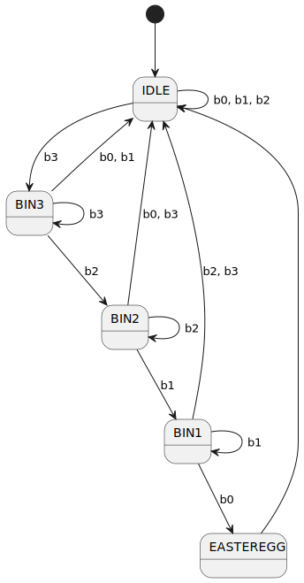

## Easter Egg

The Easter Egg is triggered by counting down from 3 to 0 in the binary system using the two buttons

* The lower button (red) is the number 1 (b1)
* The upper button (white) is the number 2 (b2)
* If no button is pressed, the number is 0 (b0)
* If both bottons are pressed the current number is 3 (b3)

<!--  -->